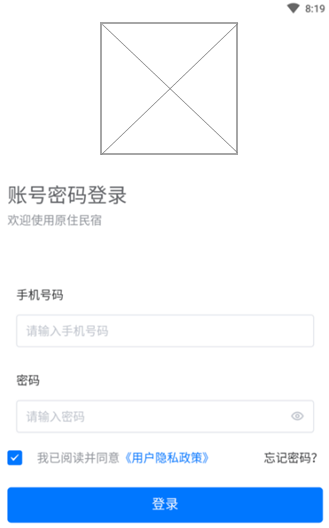
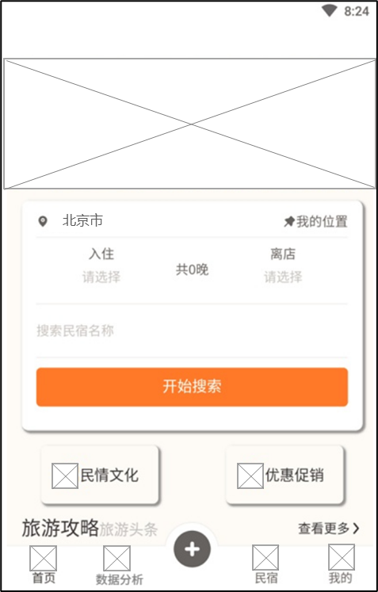
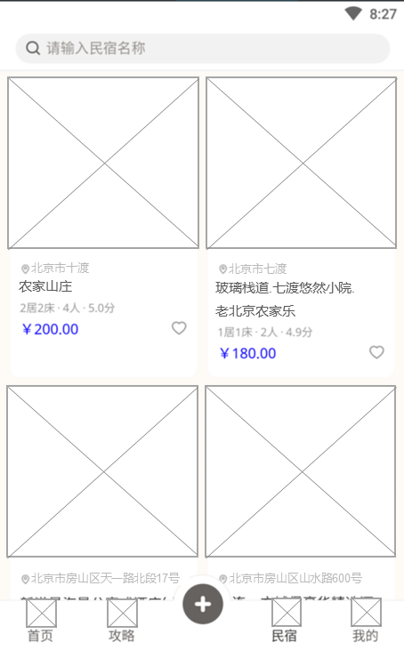
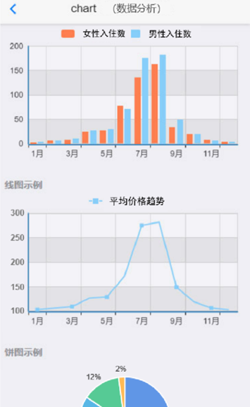
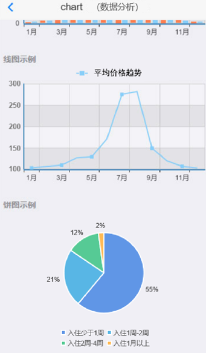

## 一、模块考核点

模块分值50分。

本模块以编程实现移动应用产品为目标，基于移动开发平台，设计移动应用 App。考查选手程序UI 还原设计能力和移动开发编程能力，其中包括App UI 编程设计、网络通信封装、异步数据通信、数据解析、数据存储、网络多媒体资源处理等技能，熟悉项目发布流程。

## 二、任务要求

1.利用移动开发工具Android Studio创建DigitalLife项目，或利用HbuilderX打开项目DigitalLife，按照任务描述完成App功能开发。

2.实现App打包发布，将打包后的release版本DigitalLife.apk文件作为模块B成果物进行提交。详见“三、成果物提交”说明。

3.后端服务接口地址：http://192.168.2.100:8088

## 三、任务描述

### （一）任务主题

乡村民宿经济发展已经成为农村数字经济发展的综合体，是农村产业融合发展最有效的切入点，更是农业供给侧结构性改革的重点，它对于落实农村发展新理念将起到重要的推动作用。民宿经济发展让农村前所未有地如此完整地浸润在市场经济之中，让农民前所未有地如此酣畅地漫游在市场海洋之中，这才是民宿经济给农村带来的最大改变。

乡村民宿是把农宅改造成“外土内洋”的旅馆酒店，是把精致小屋安放在绿水青山之中，是把城市现代生活搬到乡村来过。乡村民宿，是让游人在绿水青山中享受宁静，在蓝天白云间行走呼吸，在乡土文化中领略神奇，在乡村农家里休闲度假。乡村民宿，一个成熟的旅游市场，一个规范的旅游产业，一个可复制的经营模式，一个新颖的经济业态。民宿经济，更是融合农村一二三产业发展的切入点，整合农村资源的“牛鼻子”，关联农村整体发展的大平台。

### （二）任务描述

参赛选手根据客户提供的需求描述，按照模块B的任务要求，编码实现任务需求功能开发。

#### 任务1：实现用户登录界面（12.5分）

设计乡村民宿App，编码实现乡村民宿App的登录页面，包括手机号码、密码登录输入框，登录、忘记密码按钮，隐私协议选项。

输入账户和密码后，点击登录按钮，进入主界面。

#### 任务2：实现主界面（12.5分）

进入App主页面（主页），利用自用住宅空闲房间，结合当地人文、自然景观、生态、环境资源及农林渔牧生产活动，为外出郊游或远行的旅客提供个性化服务。

1.显示系统广告轮播图，点击轮播图跳转至民宿对应详情页面。

2.显示搜索民宿名称区域，可选择当前城市，选择入住时间、离店时间、民宿名称，点击开始搜索，跳转至民宿列表界面。

3.显示底部导航栏，采用图标加文字方式显示，图标在上，文字在下，共4个图标分别为首页、数据分析、民宿、我的，点击标签进入对应页面，并用颜色标记当前页面所在导航栏。

注：轮播图和应用服务资源通过服务器API接口获取。

#### 任务3：实现民宿列表界面（12.5分）

点击App底部民宿标签，进入民宿列表页面。

显示民宿列表，列表项包括图片、民宿名称、民宿房间规格、民宿价格、评分、民宿位置等信息。

注：数据详见API接口文档。

#### 任务4：实现数据分析功能（12.5分）

在App主页面上，点击底部导航栏“数据分析”，进入数据分析页面。

1.条形图：请分析2022年1月至12月酒店入住统计，按照男女比例进行分析，横坐标为月份，纵坐标为入住人数；（每组数据需有两个条形数据列，第一个为女性入住数统计列，第二个为男性住数统计列）

2.折线图：请分析2022年1月至12月所有民宿平均价格变化曲线，横坐标为月份，纵坐标为民宿平均价格，如（横坐标为1月、2月、3月...，纵坐标为100,150,200,250）

> 当月民宿平均价格=当月所有民宿价格之和/民宿个数

3.饼状图：请分析人员入住id为10、21、35的民宿时长占比（入住时长按周进行计算，一周为七天）。

> 接口数据详见API接口文档（需要自行处理、合并封装、解析相应接口返回的数据）。