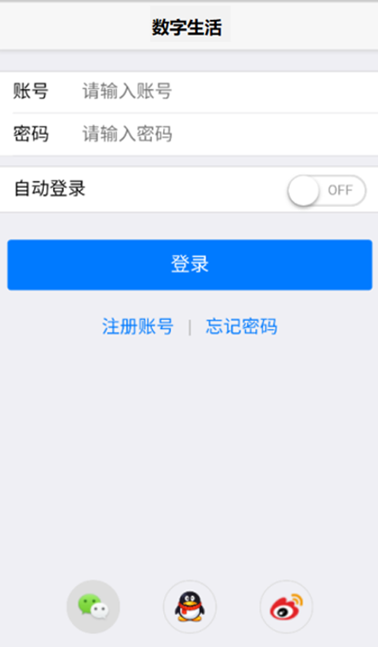
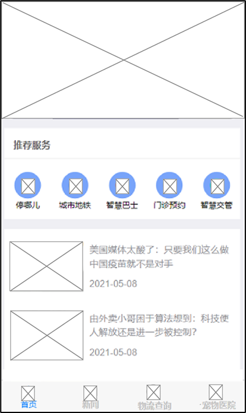
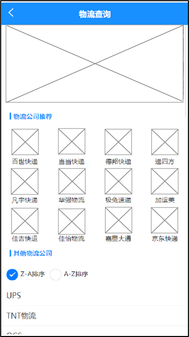
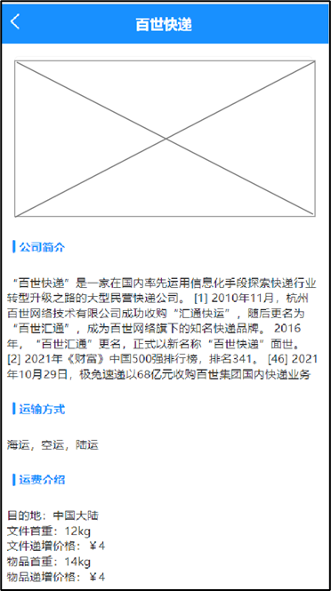
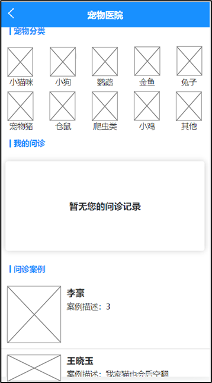
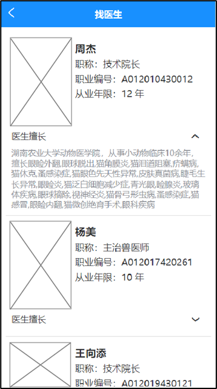

## 一、模块考核点

模块分值50分。

本模块以编程实现移动应用产品为目标，基于移动开发平台，设计移动应用 App。考查选手程序UI还原设计能力和移动开发编程能力，其中包括App UI编程设计、网络通信封装、异步数据通信、数据解析、数据存储、网络多媒体资源处理等技能，熟悉项目发布流程。

## 二、任务要求

1.利用移动开发工具Android Studio创建DigitalLife项目，或利用HbuilderX打开项目DigitalLife，按照任务描述完成App功能开发。

2.实现App打包发布，将打包后的release版本DigitalLife.apk文件作为模块B成果物进行提交。详见“三、成果物提交”说明。

3.后端服务接口地址：http://192.168.2.100:8088

## 三、任务描述

### （一）任务主题

数字生活是依托[互联网](https://baike.baidu.com/item/互联网/199186?fromModule=lemma_inlink)和一系列数字科技[技术应用](https://baike.baidu.com/item/技术应用/23733030?fromModule=lemma_inlink)为基础的一种生活方式，可以方便快捷的带给人们更好的生活体验和工作便利。随着互联网[技术应用](https://baike.baidu.com/item/技术应用/23733030?fromModule=lemma_inlink)的[全球化](https://baike.baidu.com/item/全球化/489841?fromModule=lemma_inlink)普及，互联网已经全面改变了全人类的生活方式，逐渐将人们的生活、工作等行为“一网打尽”。

### （二）任务描述

参赛选手根据客户提供的需求描述，按照模块B的任务要求，编码实现任务需求功能开发。

#### 任务1：实现用户登录功能（12.5分）

实现数字生活App的登录页面，包括App的标题、账户和密码、自动登录切换按钮、登录按钮，以及微信、QQ和sina微博快捷登录的图标。

输入账户和密码后，点击登录按钮，进入主界面。

#### 任务2：实现主界面功能（12.5分）

1.显示系统广告轮播图，点击轮播图跳转至新闻对应详情页面。

2.显示App各领域应用服务入口，以图标和名称为单元宫格方式显示，手机端每行显示3个，共两行，第2行最后一个显示“更多服务”

3.显示底部导航栏，采用图标加文字方式显示，图标在上，文字在下，共四个图标分别为首页、新闻、物流查询、宠物医院，点击标签进入对应页面，并颜色标记当前页面所在导航栏。

#### 任务3：实现物流查询功能（12.5分）

1.进入物流查询主页面，页面显示返回上一页按钮、搜索输入框、广告轮播图、物流公司推荐、下方显示其他物流公司列表。

（1）搜索输入框：输入搜索内容后，点击软键盘“搜索”按钮，判断输入数据合法性后，跳转至物流运单详情页面。

（2）广告轮播图：每间隔3秒切换广告图。

（3）物流公司推荐:以图标和名称为单元格方式显示，手机端显示4个，共三行，每个类目入口布局显示为公司logo和物流公司名称，点击图标可以进入对应物流公司详情页面。

（4）其他物流公司列表：列表项显示物流公司名称，顺序按照物流公司名称首字母降序排列。

2.物流公司详情页面：点击首页的物流公司推荐图标信息，进入对应物流公司详情页面，页面展示新闻资讯轮播、公司简介、运输方式介绍、运费介绍信息。

#### 任务4：实现宠物医院功能（12.5分）

在App主页面上，点击底部导航栏“宠物医院”，进入宠物医院页面。

1.进入宠物医院主页面，页面显示返回上一页按钮、宠物种类标题和种类、我的问诊标题和问诊列表、问诊案例标题和案例列表。

（1）宠物种类：包括狗、猫咪、小宠、水族、鸟、爬虫等种类；以宫格形式显示，每行5个，每个宫格内显示种类图标和种类名称，点击种类跳转至找医生页面。

（2）我的问诊列表：列表项显示医生头像、医生姓名和案例描述，点击列表项跳转至问诊详情页面。

（3）问诊案例列表：列表项显示医生头像、医生姓名和案例描述，点击案例跳转至案例详情页面。

2.找医生页面，页面显示医生列表，列表项左侧显示医生头像、右侧显示医生姓名、职称、执业编号、从业年限。

