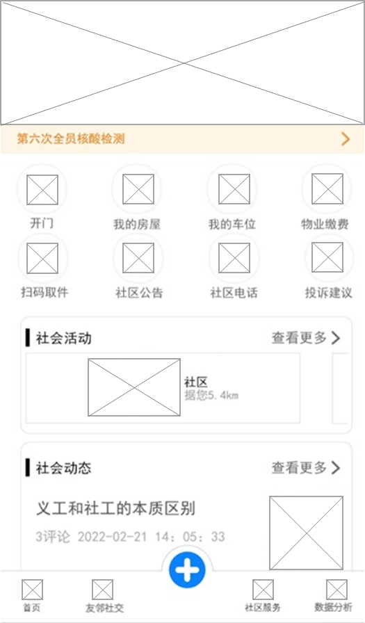
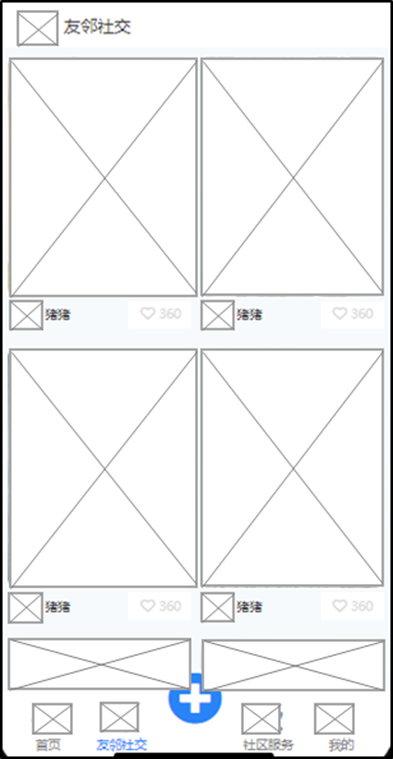
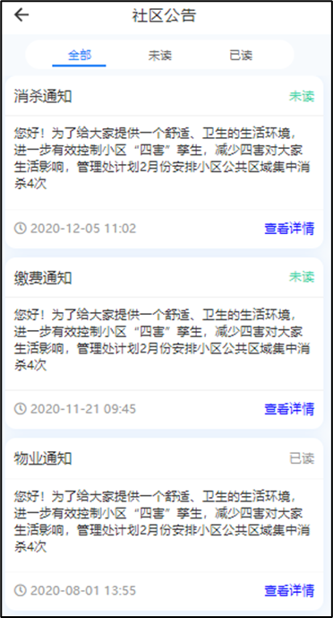
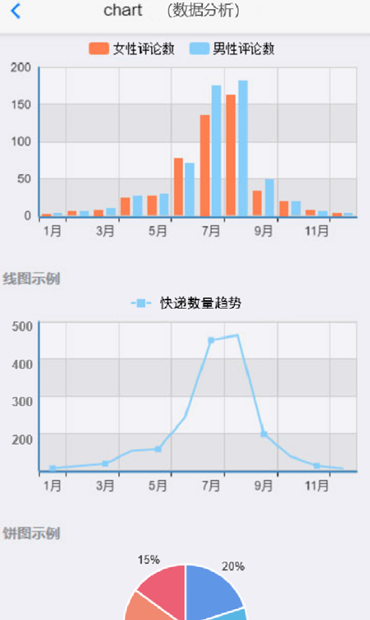
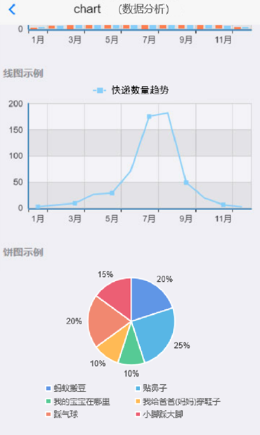

## 一、模块考核点

模块分值50分。

本模块以编程实现移动应用产品为目标，基于移动开发平台，设计移动应用 App。考查选手程序UI还原设计能力和移动开发编程能力，其中包括App UI编程设计、网络通信封装、异步数据通信、数据解析、数据存储、网络多媒体资源处理等技能，熟悉项目发布流程。

## 二、任务要求

1.利用移动开发工具Android Studio创建DigitalLife项目，或利用HbuilderX打开项目DigitalLife，按照任务描述完成App功能开发。

2.实现App打包发布，将打包后的release版本DigitalLife.apk文件作为模块B成果物进行提交。详见“三、成果物提交”说明。

3.后端服务接口地址：http://192.168.2.100:8088

## 三、任务描述

### （一）任务主题

数字社区是社区管理的新形态，它利用物联网、云计算、移动互联网等新一代信息技术的集成应用,为社区居民提供一个安全舒适的智慧化生活环境,从而形成基于信息化、智能化社区管理与服务。

“以智慧小区提升社区品质”是社区管理的目标，社区引入智慧平台能够有效推动经济流动，促进现代服务业发展。通过数字社区系统的建设，解决了社区物业管理机制的即时响应，周边商业服务的推广，社区物业通知，友邻社交的平台等居民生活需求。

### （二）任务描述

参赛选手根据客户提供的需求描述，按照模块B的任务要求，编码实现任务需求功能开发。

#### 任务1：实现社区首页功能（12.5分）

1.界面顶部显示所在社区名称、轮播图和社区发布的通知，社区通知以滚动播放的形式显示。

2.以图片和名称为单元宫格方式显示快捷功能入口，快捷功能包括开门、我的房屋、我的车位、物业缴费、扫码取件、社区公告、社区电话、投诉建议。

3.显示社区活动列表和社区动态列表，社区活动列表横向排列显示，可左右滑动查看，社区活动列表项包括活动图片、标题和距离，社区动态列表项左侧显示标题、评论数和发布时间，右侧显示图片。

4.显示底部导航栏，采用图标加文字方式显示，图标在上，文字在下，共四个图标分别为首页、友邻社交、社区服务、数据分析，点击标签进入对应页面，并颜色标记当前页面所在导航栏。

#### 任务2：实现友邻社交功能（12.5分）

1.界面显示友邻社交标题栏和帖子列表，动态列表项包括图片、发布人和点赞数，点击列表项进入帖子详情。

2.帖子详情界面显示标题栏、发布人、发布时间、发布内容和用户评论，用户评论包括评论总数、发布评论的用户头像、昵称、发布日期、评论点赞数和评论内容，界面底部显示发表评论输入框和发布按钮，输入评论内容并点击发布按钮即可发布评论。

#### 任务3：实现社区公告功能（12.5分）

点击首页社区公告菜单，进入社区公告页面。

1.界面显示标题栏、公告状态菜单栏、通知列表，点击状态菜单可显示对应状态的通知列表，通知列表项包括标题、状态、通知内容、发布时间和查看详情按钮，点击列表项进入详情界面。

2.公告详情界面显示标题栏、公告标题、发布时间、通知内容、发布单位和联系电话。

#### 任务4：实现数据分析功能（12.5分）

在App主页面上，点击底部导航栏“数据分析”，进入数据分析页面。

1.条形图：请分析2022年1月至12月id为32的新闻信息的评论数量，按照性别比例进行分析，横坐标为月份，纵坐标为新闻评论数；（每组数据需有两个条形数据列，第一个为女性评论数统计列，第二个为男性评论数统计列）

2.折线图：请分析统计所有2022年1月至12月所有用户购买快递数量变化趋势，横坐标为月份，纵坐标为用户购买快递数量，如（横坐标为1月、2月、3月...，纵坐标为200、300、400、500）。

3.饼状图：请分析点赞人数排名前五的亲子类型活动，其中每个活动的报名人数占这五个活动总报名人数的百分比。（图内显示相应活动名称及比例值）

> 接口数据详见API接口文档（需要自行处理、合并封装、解析相应接口返回的数据）。