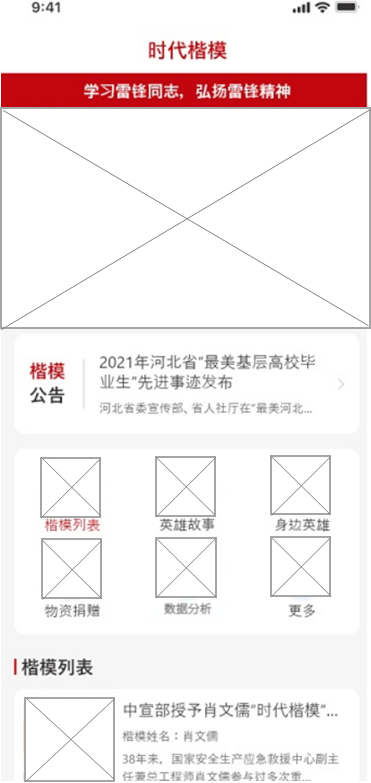
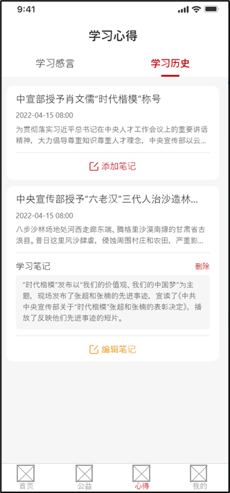
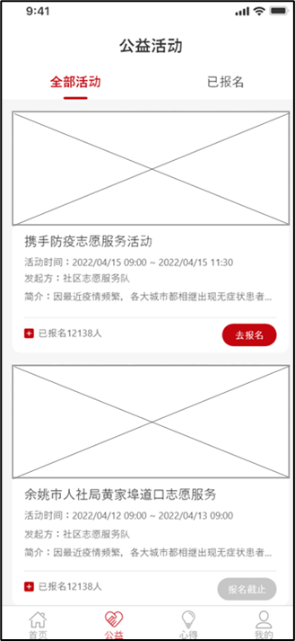
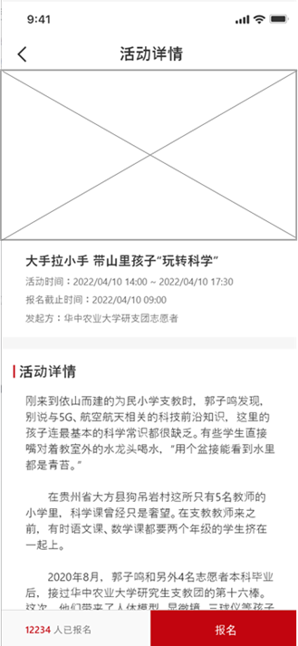
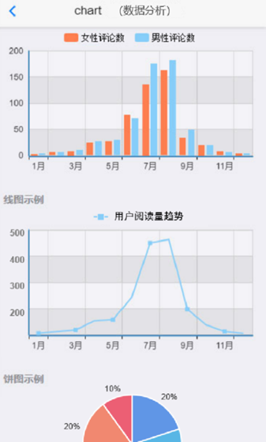
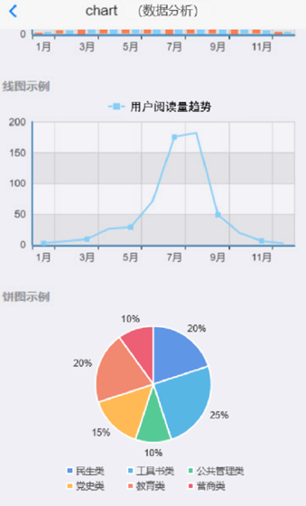

## 一、模块考核点

模块分值50分。

本模块以编程实现移动应用产品为目标，基于移动开发平台，设计移动应用 App。考查选手程序UI还原设计能力和移动开发编程能力，其中包括App UI编程设计、网络通信封装、异步数据通信、数据解析、数据存储、网络多媒体资源处理等技能，熟悉项目发布流程。

## 二、任务要求

1.利用移动开发工具Android Studio创建DigitalLife项目，或利用HbuilderX打开项目DigitalLife，按照任务描述完成App功能开发。

2.实现App打包发布，将打包后的release版本DigitalLife.apk文件作为模块B成果物进行提交。详见“三、成果物提交”说明。

3.后端服务接口地址：http://192.168.2.100:8088

## 三、任务描述

### （一）任务主题

“时代楷模”是由中宣部集中组织宣传的全国重大先进典型。时代楷模充分体现“爱国、敬业、诚信、友善”的价值准则，充分体现中华传统美德，是具有很强先进性、代表性、时代性和典型性的先进人物。时代楷模事迹厚重感人、道德情操高尚、影响广泛深远。根据时代楷模的职业身份，以中宣部和有关部门名义发布。在中央电视台设立“时代楷模”发布厅。

随着经济快速发展，计算机的普及率越来越高，网民数量逐年增多，在多元的网络文化中，他们很容易被负面文化影响，误入歧途。时代楷模App是运用信息化新技术，整合各方资源，让更多的年轻人通过该平台看要闻，了解两会，学新思想，明历史，长知识，知晓时政综合，紧跟党的步伐，不断武装思想。

### （二）任务描述

参赛选手根据客户提供的需求描述，按照模块B的任务要求，编码实现任务需求功能开发。

#### 任务1：实现时代楷模首页功能（12.5分）

任务说明：

1.进入App主页面（主页）上方显示轮播图。

2.显示App各领域应用服务入口，以图标和名称为单元宫格方式显示，手机端每行显示3个，包括楷模列表、英雄故事、身边英雄、物资捐赠、数据分析。每个领域应用入口布局显示为圆形图标+名称布局，点击图标可进入对应的领域应用页面。

3.下方显示热点楷模新闻信息列表，新闻列表内容包括标题、楷模姓名、新闻缩略图、内容（字数过多使用...代替）等，默认显示5条，新闻列表下方显示“查看更多”按钮，点击“查看更多”按钮多显示5条楷模新闻信息。

4.显示底部导航栏，采用图标加文字方式显示，图标在上，文字在下，共四个图标分别为首页、公益、心得、数据分析，点击标签进入对应页面，并颜色标记当前页面所在导航栏。

#### 任务2：实现学习心得功能（12.5分）

任务说明：

1.顶部显示两个Tab栏，包括学习感言和学习历史，点击不同的标签切换不同的信息。

2.学习感言列表包括感言标题、感言内容（字数过多使用...代替）。

3.学习历史包括学习内容标题、文章发布时间、文章内容等，学习内容下方有“添加笔记”按钮，点击“添加笔记”按钮可添加、编辑、删除当前用户的学习笔记。

#### 任务3：实现公益活动功能（12.5分）

任务说明：

1.进入公益活动界面，界面内包括活动展示、活动报名。

2.活动展示内容包括报名人数、活动大图、活动起止时间、发起方简介、“报名”按钮等。

3.点击“报名”按钮，进入活动报名详情界面，活动报名包括：活动展示图片、活动名称、活动起止时间、活动详情、已报名人数、“报名”按钮，点击“报名”，弹出确认框，点击“确认”，可报名该活动。

 

任务4：实现数据分析功能（12.5分）

在App主页面上，点击底部导航栏“数据分析”，进入数据分析页面。

 

1.条形图：请分析2022年1月至12月评论数量新闻信息的评论数量，按照性别比例进行分析，横坐标为月份，纵坐标为新闻评论数；（每组数据需有两个条形数据列，第一个为女性评论数统计列，第二个为男性评论数统计列）。

2.折线图：请分析统计所有2022年1月至12月所有用户阅读书籍数量变化趋势，横坐标为月份，纵坐标为阅读书籍数量，如（横坐标为1月、2月、3月...，纵坐标为200、300、400、500）。

3.饼状图：请分析用户阅读书籍类型占总书籍类型的比例。（图内显示相应回收品类名称及比例值）。

> 接口数据详见API接口文档（需要自行处理、合并封装、解析相应接口返回的数据）。