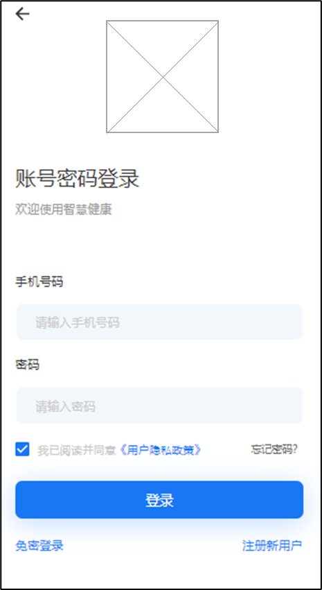
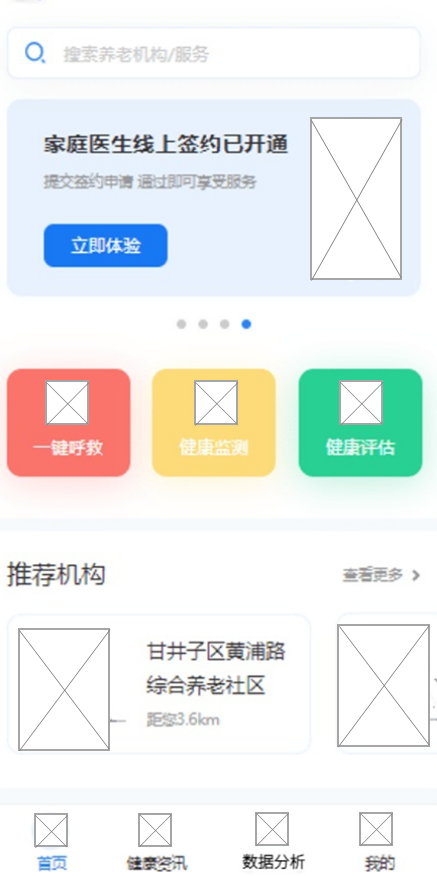
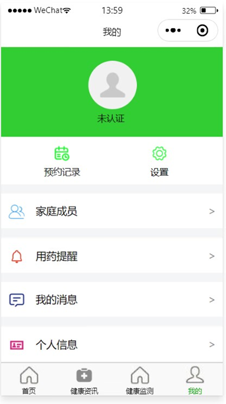
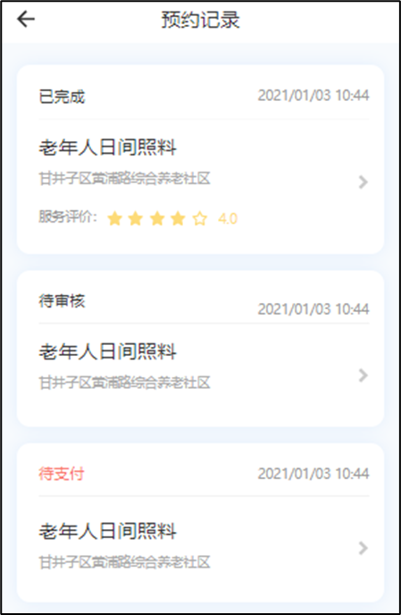
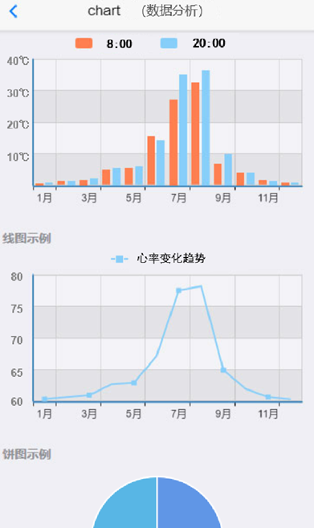
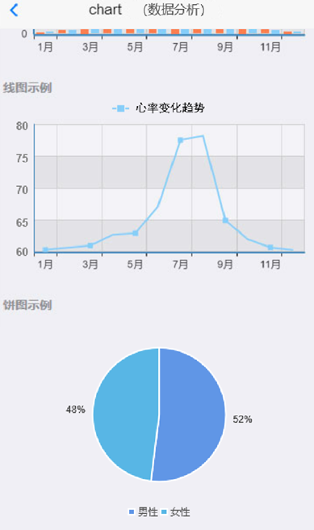

## 一、模块考核点

模块分值50分。

本模块以编程实现移动应用产品为目标，基于移动开发平台，设计移动应用 App。考查选手程序UI 还原设计能力和移动开发编程能力，其中包括App UI 编程设计、网络通信封装、异步数据通信、数据解析、数据存储、网络多媒体资源处理等技能，熟悉项目发布流程。

## 二、任务要求

1.利用移动开发工具Android Studio创建DigitalLife项目，或利用HbuilderX打开项目DigitalLife，按照任务描述完成App功能开发。

2.实现App打包发布，将打包后的release版本DigitalLife.apk文件作为模块B成果物进行提交。详见“三、成果物提交”说明。

3.后端服务接口地址：http://192.168.2.100:8088

## 三、任务描述

### （一）任务主题

“智慧健康”是面向居家老人、社区及养老机构提供实时、快捷、高效、低成本智能化的养老服务平台。

随着经济的发展，人民的生活水平得到普遍提高，随之而来的是我国的老龄化程度越来越高，人们已经普遍意识到老龄化问题将会带来的问题。整个社会在趋向于“衰老型”发展，人口老龄化的问题日益严重，空巢老人的现象也日益加剧。呈现出老年人口基数大、增速快、高龄化、失能化、空巢化趋势明显的态势，再加上我国未富先老的国情和家庭小型化的结构叠加在一起，养老问题异常严峻。智慧健康平台主要围绕着利用先进的信息技术手段实现“以入住老人为中心，规范养老服务，强化养老管理”，同时，针对老年人心理生理特点，以信息化技术为核心，采用先进的计算机技术、通信技术、无线传输技术、控制技术，为老人提供一个安全、便捷、高效、舒适的养老综合服务。

### （二）任务描述

参赛选手根据客户提供的需求描述，按照模块B的任务要求，编码实现任务需求功能开发。

#### 任务1：实现用户登录功能（12.5分）

设计健康App，利用移动开发工具（Android Studio）创建SmartCity项目或HbuilderX打开项目，编码实现健康App的登录页面，包括手机号码、密码登录输入框，登录按钮、忘记密码按钮、隐私协议选项。

输入账户和密码后，点击登录按钮，进入主界面。

#### 任务2：实现健康首页功能（12.5分）

1．界面顶部显示标题栏左侧显示应用图标和标题，右侧显示定位图标和所在城市，标题栏下方显示搜索框和广告轮播图。

2．以图片和名称为单元宫格方式显示快捷功能入口，在移动端中一行显示3个，快捷功能包括一键呼救、健康监测和健康评估。

3．显示推荐机构列表和健康资讯列表，推荐机构列表横向排列显示，可左右滑动查看，推荐机构列表项包括机构图片、名称和距离，健康资讯列表项左侧显示标题、评论数和发布时间，右侧显示图片。

4．显示底部导航栏，采用图标加文字方式显示，图标在上，文字在下，共4个图标分别为首页、健康资讯、数据分析、我的，点击标签进入对应页面，并用颜色标记当前页面所在导航栏。

#### 任务3：实现预约记录功能（12.5分）

在我的页面中点击预约记录，进入预约记录页面。

1．界面顶部显示预约记录标题栏，点击标题栏中的返回按钮返回上一页，标题栏下方显示预约记录列表，列表项以卡片的形式显示，列表项顶部左侧显示预约状态，右侧显示预约日期，列表项内容部分显示服务名称、所属机构和服务评分，点击列表项进入预约详情页面。

2．预约详情界面顶部显示标题栏，标题栏下方显示预约状态、服务信息、预约信息、支付信息和底部按钮，预约状态包括已完成、待审核、待支付、已支付、审核未通过、已取消，服务信息包括服务名称、所属机构、机构地址和服务价格，预约信息包括预约编号、服务名称、费用，支付信息包括支付方式、支付时间、支付金额，当预约状态为已完成时，底部显示服务评价按钮，预约状态为待审核或已支付时标题栏右侧显示取消预约文字按钮，预约状态为待支付时标题栏右侧显示取消预约文字按钮并且底部显示立即支付按钮，预约状态为审核未通过或已取消时，底部显示重新预约按钮。

#### 任务4：实现数据分析功能（12.5分）

在App主页面上，点击底部导航栏“数据分析”，进入数据分析页面。

1.条形图：请分析2022年1月至12月，id为20号房间的早八点和晚八点温度（单位为摄氏度），横坐标为月份，纵坐标为温度数值；（每组数据需有两个条形数据列，第一个为早八点温度数据列，第二个为晚八点温度数据列）。

2.折线图：请分析统计所有2022年10月5日早10点至10点20当前登录用户心率变化，横坐标为月份，纵坐标为心率数值，如（横坐标为10:00、10:01、10:02...，纵坐标为70,75,80）。

3.饼状图：请分析App用户男女比例。（图内显示相应男女标识及比例值）。

> 接口数据详见API接口文档（需要自行处理、合并封装、解析相应接口返回的数据）。