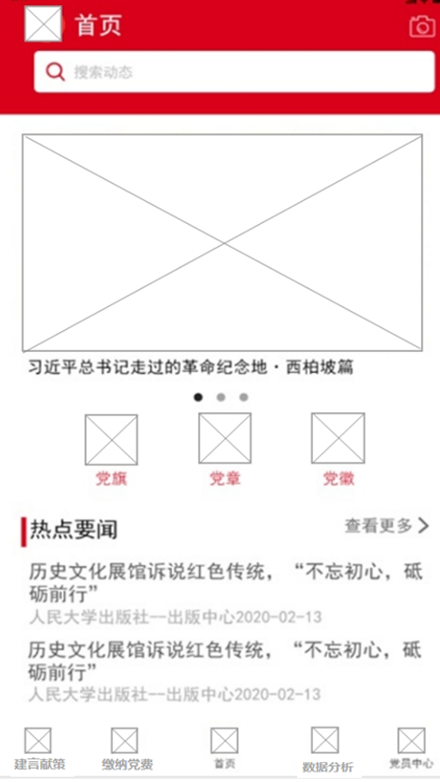
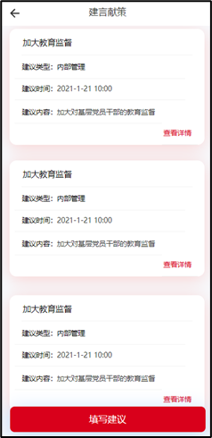
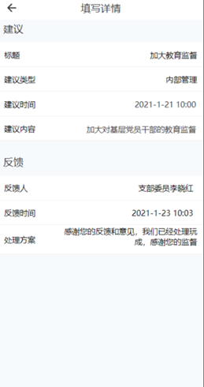
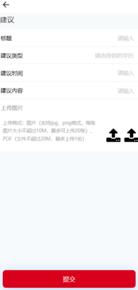
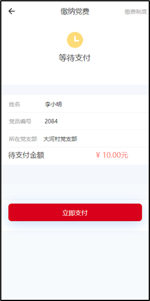
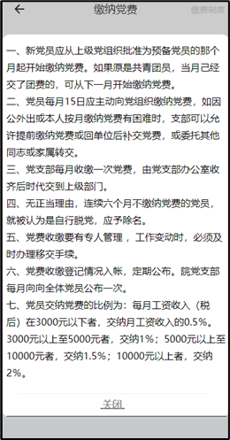
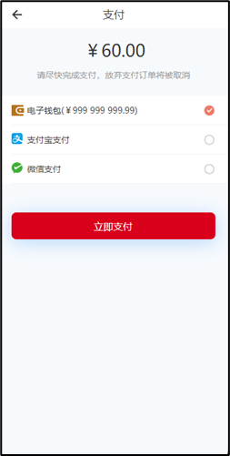
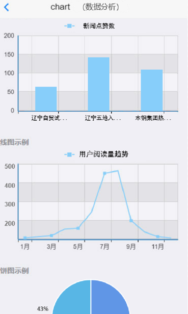
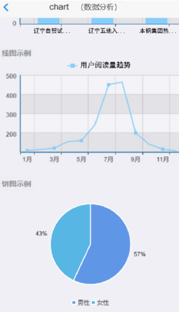

## 一、模块考核点

模块分值50分。

本模块以编程实现移动应用产品为目标，基于移动开发平台，设计移动应用 App。考查选手程序UI还原设计能力和移动开发编程能力，其中包括App UI编程设计、网络通信封装、异步数据通信、数据解析、数据存储、网络多媒体资源处理等技能，熟悉项目发布流程。

## 二、任务要求

1.利用移动开发工具Android Studio创建DigitalLife项目，或利用HbuilderX打开项目DigitalLife，按照任务描述完成App功能开发。

2.实现App打包发布，将打包后的release版本DigitalLife.apk文件作为模块B成果物进行提交。详见“三、成果物提交”说明。

3.后端服务接口地址：http://192.168.2.100:8088

## 三、任务描述

### （一）任务主题

随着人们生活和工作的信息化、网络化、数据化持续加深，传统的党建工作方式对党员，特别是年轻一代党员的吸引力和凝聚力在降低。智慧党建是运用数字信息化新技术，整合各方资源，更有效地加强组织管理，提高服务群众的水平，扩大党在网络世界的存在感和数字化影响力，提高党的执政能力，巩固党的执政基础的新平台、新模式、新形态。

通过智慧党建系统建设，主要解决党建宣传、学习、管理、资源等方面的基础问题，使党建管理从模糊走向精确，改变了以往手工操作、人工管理等存在的随意性、模糊性不足，通过量化计分、实时智能分析、自动提醒服务等实现党建管理的精确化、智能化、人文化和科学化。

### （二）任务描述

参赛选手根据客户提供的需求描述，按照模块B的任务要求，编码实现任务需求功能开发。

#### 任务1：实现首页功能（12.5分）

任务说明：

1.顶部显示轮播图。

2.显示智慧党建各领域应用服务入口，以图标和名称为单元宫格方式显示，手机端每行显示3个，分别为“党旗”“党章”“党徽”。

3.下方显示热点新闻列表，热点新闻包括新闻标题、新闻发布时间、出版社，默认显示5条，新闻列表下方显示“查看更多”按钮，点击“查看更多”按钮多显示5条新闻信息。

4.显示底部导航栏，采用图标加文字方式显示，图标在上，文字在下，共五个图标分别为建言献策、缴纳党费、首页、数据分析、党员中心，点击标签进入对应页面，并颜色标记当前页面所在导航栏。

#### 任务2：实现建言献策功能（12.5分）

1.界面包括两个部分，在页面主体部分以卡片风格展示建言献策相关信息的列表，每个卡片底部都放置一个跳转建言献策详情的按钮，详情页面展示“标题”“建议类型”“建议时间”“建议内容”“反馈人”“反馈时间”“处理方案”的各项信息，列表界面只显示该条建议的“建议类型”“建议时间”和“建议内容”。

2.在列表界面的下方放置一个“填写建议”按钮，点击后跳转到填写建议页面，新增建议页面包含“标题”“建议类型”“建议时间”“建议内容”并支持上传图片，在新增建议页面底部放置提交按钮。

#### 任务3：实现缴纳党费功能（12.5分）

任务说明：

1.缴纳党费界面包括三个部分，上半部分右上角有个缴费制度，点击可以查看缴费制度详情，下面是支付结果。

2.中间部分显示支付人姓名、党员编号、所在党支部、待支付金额，金额需要加红色。

3.下半部分有个立即支付按钮，点击立即支付跳转到支付页面，支付页面显示支付金额、支付方式、立即支付按钮，点击立即支付即可支付成功。

#### 任务4：实现数据分析功能（12.5分）

在App主页面上，点击底部导航栏“数据分析”，进入数据分析页面。

1.条形图：请分析前3条新闻的点赞数量，横坐标为新闻标题，纵坐标为新闻点赞数（新闻标题默认显示5个字，剩余使用...代替）。

2.折线图：请分析统计所有2022年1月至12月所有用户阅读书籍数量变化趋势，横坐标为月份，纵坐标为阅读书籍数量，如（横坐标为1月、2月、3月...，纵坐标为200、300、400、500）。

3.饼状图：请分析App使用用户的男女比例。（图内显示相应男女名称及比例值）。

> 接口数据详见API接口文档（需要自行处理、合并封装、解析相应接口返回的数据）。